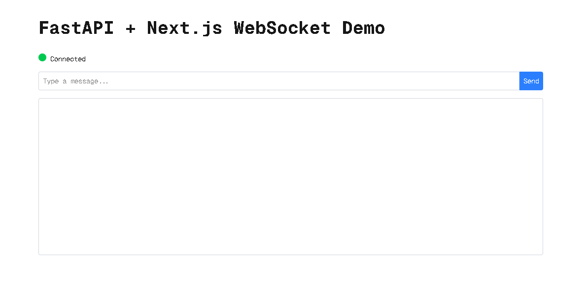
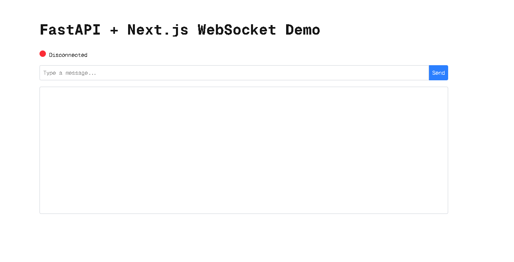
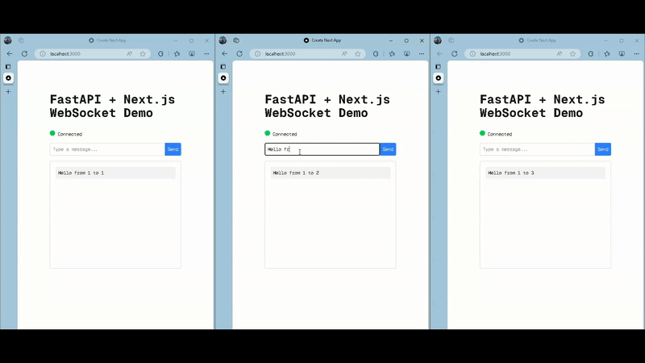

# WebSocket Demo Application

This is a simple WebSocket-based application built using **FastAPI** for the backend and **Next.js** for the frontend. It demonstrates real-time communication between clients using WebSocket technology.

## Features

- Real-time message broadcasting to all connected clients.
- WebSocket connection status indicator.
- Dockerized setup for easy deployment.

## Project Structure

```
WebSocketDemoSetup/
├── backend/          # FastAPI backend
├── frontend/         # Next.js frontend
├── docker-compose.yml
└── README.md
```

## Prerequisites

- Docker and Docker Compose installed on your system.
- Node.js and Python (if running locally without Docker).

## Setup Instructions

### Using Docker

1. Clone the repository:

   ```bash
   git clone https://github.com/romik-ank/websocket_sample.git

   cd WebSocketDemoSetup
   ```

2. Build and start the services:

   ```bash
   docker-compose up --build
   ```

3. Access the application:
   - Frontend: [http://localhost:3000](http://localhost:3000)
   - Backend: [http://localhost:8000](http://localhost:8000)

### Running Locally

#### Backend

1. Navigate to the `backend` directory:

   ```bash
   cd backend
   ```

2. Install dependencies:

   ```bash
   pip install -r requirements.txt
   ```

3. Start the FastAPI server:
   ```bash
   uvicorn main:app --host 0.0.0.0 --port 8000
   ```

#### Frontend

1. Navigate to the `frontend` directory:

   ```bash
   cd frontend
   ```

2. Install dependencies:

   ```bash
   npm install
   ```

3. Start the Next.js development server:

   ```bash
   npm run dev
   ```

4. Access the frontend at [http://localhost:3000](http://localhost:3000).

## How It Works

1. The backend provides a WebSocket endpoint (`/ws`) for real-time communication.
2. The frontend connects to the WebSocket server and allows users to send and receive messages.
3. Messages sent by one client are broadcast to all connected clients.

## Technologies Used

- **Backend**: FastAPI, Uvicorn
- **Frontend**: Next.js, React
- **WebSocket**: Native WebSocket API
- **Containerization**: Docker, Docker Compose

## Screenshots

### WebSocket Connection Status

<p align="center">
  
  
</p>

### Real-time Messaging

